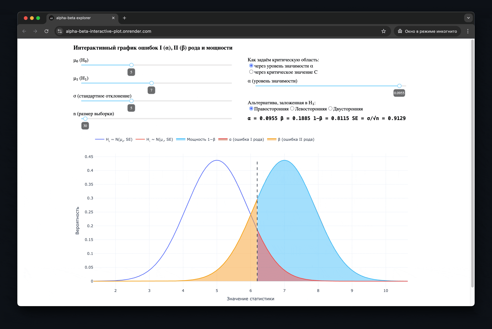

# alpha-beta explorer

Интерактивная визуализация ошибок I (α), II (β) рода и мощности (1−β).

**Веб-версия** на Render: **https://alpha-beta-interactive-plot.onrender.com/**

**Зачем?** График помогает понять зависимость между ошибками I и II рода.
